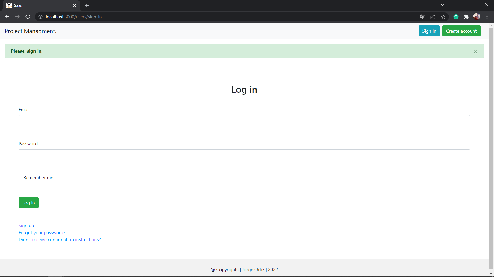
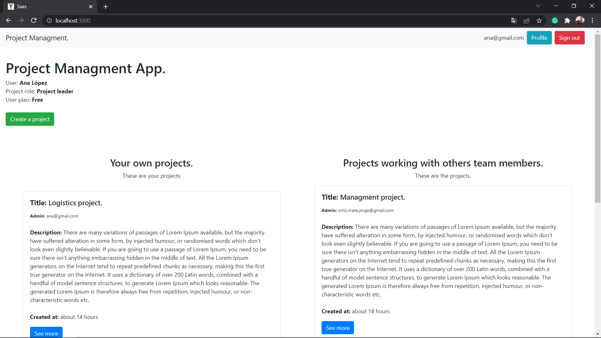
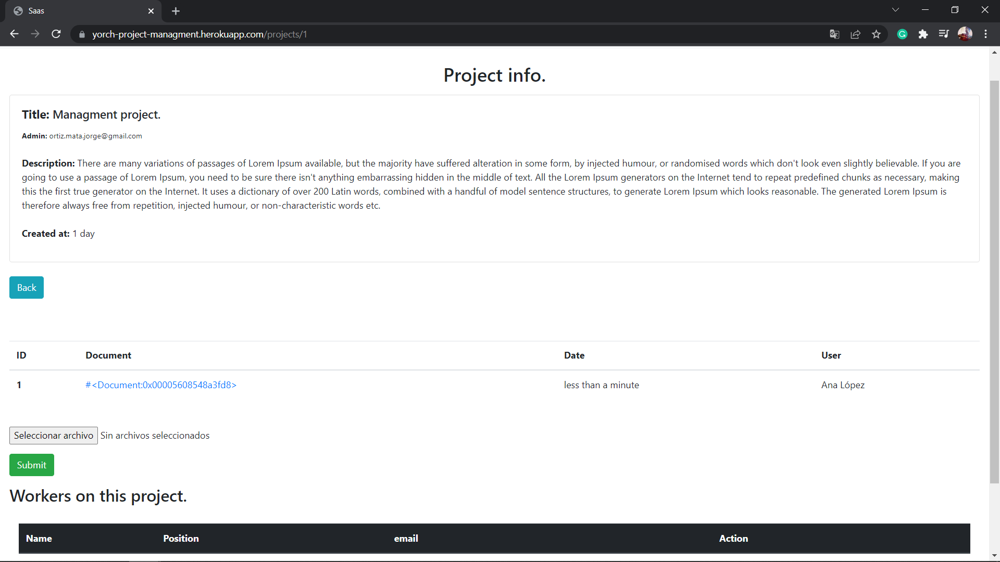

# Project Managment App.

Project Managment App was developed using Ruby and Ruby on Rails 7.

## App.

Heroku link: https://yorch-project-managment.herokuapp.com/

## Description

Withtin Project Managment App you will be able to sign up as 
project leader or as a team member.
A project leader can create projects and invite other people to work
in that project, meanwhile, the team member can't create projects
or invite others users.

The project leader has two plans, free and premium. The free plan
allows the user to create a maximum of three projects and, the 
premium plan allows the user to create a maximum of ten projects.

Finally, each member working on the same project, has the feature of
upload and download project's files. 

## Softwares and frameworks.

* Ruby: 3.0.1
* Ruby on Rails: 7.0.2
* Google Cloud Storage.
* Hotwire.
* Bootstrap 4.
* PostgreSQL.
* VSCode.
* Windows 10.

## Author:

* Jorge Ortiz Mata.
* San Luis Potosí S.L.P. México
* ortiz.mata.jorge@gmail.com
* +52 (444) 576 3034.

## Images.

-----

-----

